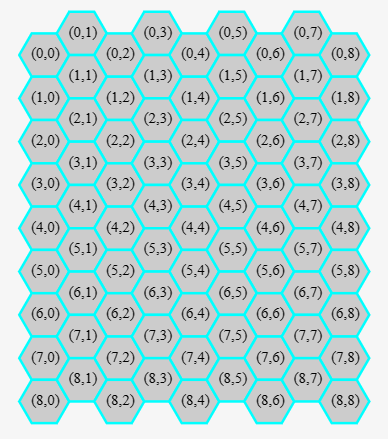
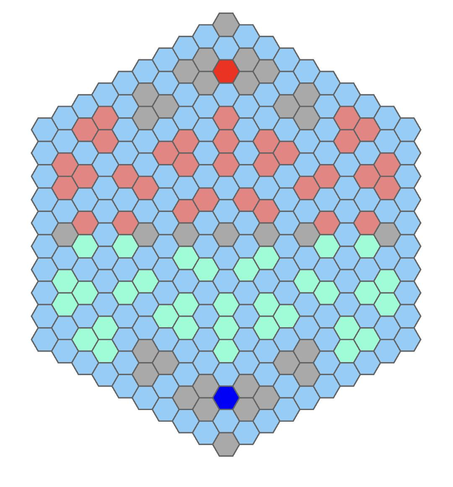

# antgame2_game48

- Source mhtml: `蚁洋陷役2 - Saiblo.mhtml`
- Reconstructed from the page content captured in the mhtml; local images are extracted under `docs/mhtml_assets/antgame2_game48/`.
- Important: the codebase under `Game1/Ant-Game` is the source of truth when this markdown conflicts with implementation.

# 2025-2026 第三十届智能体大赛 蚁洋陷役2

## 代码入口

- 后端规则入口：`SDK/backend/`
- 训练入口：`SDK/training/`
- 对外训练脚本：`SDK/train_mcts.py`、`SDK/train_mcts.sh`、`SDK/train_example.py`、`SDK/train_example.sh`
- AI 示例入口：`AI/ai_example.py`

## 一、游戏规则简介

​	这是一款双人在六边形网格地图上对抗的策略游戏，双方玩家分别操控己方基地，通过每回合自动生成并派遣蚂蚁进攻敌方基地，同时可以消耗金币建造、升级或降级多种类型的防御塔来防守和干扰敌人，也能使用四种具有不同持续效果和冷却时间的超级武器（如闪电风暴、EMP轰炸、引力护盾和紧急回避）来改变局部战局。

## 二、游戏规则详解

### 1. 基本数据

- 本游戏回合数从**0**开始，双方分别操作一次算作一回合。回合数到达512时结束游戏。
- “工蚁”具有年龄。年龄等于**当前回合数 - 生成回合数**。当年龄大于32时，蚂蚁死亡/消失。
- 每只“工蚁”具有一个**类型**属性，分为：**保守型**、**默认型**、**随机型**、**蛊惑型**、**免控型**。不同类型遵循不同的移动规则（详见2.7节）。
- 规定AI每回合运行时间上限为**1秒**。

### 2. 游戏地图与坐标

本游戏采用六边形格点地图，采用“even-q”坐标系，如下图所示：



每个格点都有六个方向，计算相邻坐标的算法如下所示。需要额外注意的就是本坐标系在奇数列和偶数列需要分别处理。

六个下标的顺序为右上、上、左上、左下、下、右下。

```python
direction_difference = [[
    # even columns
    [0,  1], [-1, 0], [0, -1],
    [1, -1], [ 1, 0], [1,  1],
],[
    # odd columns
    [-1,  1], [-1,  0], [-1, -1],
    [ 0, -1], [ 1,  0], [ 0,  1],
]]

def calculate_neighbor(pos, direction):
    diff = direction_difference[place % 2][direction]
    return [pos[0] + diff[0], pos[1] + diff[1]]
```

本游戏的地图是一个边长为10的正六边形，也就是到中心点(9,9)的距离小于等于9的所有点的集合，如下图所示。其中：

- 红色网格(2,9)为玩家0的基地
- 深蓝色网格(16,9)为玩家1的基地
- 粉色区域是玩家0可以放置防御塔的区域
- 淡绿色区域是玩家1可以建造防御塔的区域
- 浅蓝色网格（以及两个基地）为蚂蚁可移动的区域，而其余颜色是蚂蚁不可移动的区域。



下面是不可移动区域的坐标列表：

```c++
{
    {6, 1}, {7, 1}, {9, 1}, {11, 1}, {12, 1}, {4, 2}, {6, 2}, {8, 2},
    {9, 2}, {11, 2}, {13, 2}, {4, 3}, {5, 3}, {13, 3}, {14, 3}, {6, 4}, 
    {8, 4}, {9, 4}, {11, 4}, {3, 5}, {4, 5}, {7, 5}, {9, 5}, {11, 5}, 
    {14, 5}, {15, 5}, {3, 6}, {5, 6}, {12, 6}, {14, 6}, {2, 7}, {5, 7}, 
    {6, 7}, {8, 7}, {9, 7}, {10, 7}, {12, 7}, {13, 7}, {16, 7}, {1, 8}, 
    {2, 8}, {7, 8}, {10, 8}, {15, 8}, {16, 8}, {0, 9}, {4, 9}, {5, 9}, 
    {6, 9}, {9, 9}, {12, 9}, {13, 9}, {14, 9}, {18, 9}, {1, 10}, {2, 10}, 
    {7, 10}, {10, 10}, {15, 10}, {16, 10}, {2, 11}, {5, 11}, {6, 11}, {8, 11}, 
    {9, 11}, {10, 11}, {12, 11}, {13, 11}, {16, 11}, {3, 12}, {5, 12}, {12, 12}, 
    {14, 12}, {3, 13}, {4, 13}, {7, 13}, {9, 13}, {11, 13}, {14, 13}, {15, 13}, 
    {6, 14}, {8, 14}, {9, 14}, {11, 14}, {4, 15}, {5, 15}, {13, 15}, {14, 15}, 
    {4, 16}, {6, 16}, {8, 16}, {9, 16}, {11, 16}, {13, 16}, {6, 17}, {7, 17}, 
    {9, 17}, {11, 17}, {12, 17}
}
```

下面是粉色区域的坐标列表：

```c++
{
    {6, 1}, {7, 1}, {4, 2}, {6, 2}, {8, 2}, {4, 3}, {5, 3}, {6, 4}, 
    {8, 4}, {7, 5}, {5, 6}, {5, 7}, {6, 7}, {8, 7}, {7, 8}, {4, 9}, 
    {5, 9}, {6, 9}, {7, 10}, {5, 11}, {6, 11}, {8, 11}, {5, 12}, {7, 13}, 
    {6, 14}, {8, 14}, {4, 15}, {5, 15}, {4, 16}, {6, 16}, {8, 16}, {6, 17}, {7, 17}
}
```

下面是淡绿色区域的坐标列表：

```c++
{
    {11, 1}, {12, 1}, {9, 2}, {11, 2}, {13, 2}, {13, 3}, {14, 3}, {9, 4}, 
    {11, 4}, {11, 5}, {12, 6}, {10, 7}, {12, 7}, {13, 7}, {10, 8}, {12, 9}, 
    {13, 9}, {14, 9}, {10, 10}, {10, 11}, {12, 11}, {13, 11}, {12, 12}, {11, 13}, 
    {9, 14}, {11, 14}, {13, 15}, {14, 15}, {9, 16}, {11, 16}, {13, 16}, {11, 17}, {12, 17}
}
```

### 3. 经济系统

- 玩家初始具有50金币。
- 每回合**结束**时，给予双方玩家1金币。
- **在结算阶段**，本回合每使用防御塔或超级武器杀死一只对方蚂蚁，按照对方蚂蚁的等级，等级1的蚂蚁给予3金币，等级2的蚂蚁给予5金币，等级3的蚂蚁给予7金币。本回合每有一只蚂蚁到达敌方基地，给予5金币。因寿命死亡的蚂蚁不对金币产生影响。

### 4. 防御塔

- **建造价格**：建造**新的**防御塔的价格为 $15\times 2^i$，其中i为当前存在的己方防御塔的数量。或者说，建造第一个防御塔的金额为15，建造第二座防御塔的价格为30，建造第三座防御塔的价格为60，以后每座防御塔的建造价格均翻倍。

- **升级价格**：防御塔一共分为三个等级，共13种类。等级1升级到等级2需要60金币，等级2升级到等级3需要200金币。

- **降级、拆除返还**：降级、拆除防御塔会返还 $80\%$ 的建造花销，即等级3降级为等级2返还160金，等级2降级为等级1返还48金，拆除等级1返还$12\times 2^i$金，其中$i$为**拆除之后**己方防御塔的数量。

- **防御塔攻击**：每种类防御塔都有固定的伤害、攻击间隔、攻击次数、攻击方式、攻击范围。*攻击间隔为K，攻击次数为M*意为防御塔内置CD为0时，可以进行M次攻击，若攻击到任何“工蚁“，则重置CD为K，否则CD不变。

  还需指出：建造、升级、降级防御塔都会令内置CD为攻击间隔K。

- **索敌逻辑**：选取范围内血量大于0且非己方的敌人，按照与防御塔的距离为主键、“工蚁”的ID为附键升序排列。顺序越靠前攻击优先级越高。用代码表示为：

  ```python
  targets = ants_in_range(tower.x, tower.y, tower.range)
              .filter((ant) => ant.hp > 0 && ant.player != tower.player)
              .sort((a, b) => a_dist == b_dist ? a.id - b.id : a_dist - b_dist)
  // a_dist = distance([tower.x, tower.y], [ant.x, ant.y])
  ```

- 若非特殊说明，默认的攻击方式就是对优先级最高的“工蚁”造成一定的伤害。

- **AOE攻击**：部分防御塔拥有“AOE”(Area of effect)攻击属性。若为“范围为R的AOE攻击”，即为对优先级最高的“工蚁”及到其所在格距离不大于R的格子中所有“工蚁”均造成伤害。**这有可能影响到本来不处于攻击范围内的敌方“工蚁”。**

- **防御塔数据列表**（更新了部分防御塔的效果）

  | 类型ID | 名称    | 伤害 | 间隔 | 范围 | 攻击方式&特殊效果                                            | 上级防御塔 |
  | ------ | ------- | ---- | ---- | ---- | ------------------------------------------------------------ | ---------- |
  | 0      | Basic   | 5    | 2    | 2    | Default                                                      | 无         |
  |        |         |      |      |      |                                                              |            |
  | 1      | Heavy   | 20   | 2    | 2    | Default                                                      | 0          |
  | 11     | Heavy+  | 35   | 2    | 3    | Default                                                      | 1          |
  | 12     | Ice     | 15   | 2    | 2    | Default，但会将命中的蚂蚁**冻结**一回合（该回合无法移动），冻结解除后蚂蚁类型变为**随机型**。 | 1          |
  | 13     | Bewitch | 50   | 3    | 3    | Default，将命中的蚂蚁转为**蛊惑型**，并根据蚂蚁当前位置设置目标：若蚂蚁在自己的半场（以x=9为界，x<9为玩家0半场，x>9为玩家1半场），目标为敌方基地；若在对方半场，目标为蚂蚁所属阵营自己半场的随机合法位置。 | 1          |
  |        |         |      |      |      |                                                              |            |
  | 2      | Quick   | 6    | 1    | 3    | Default                                                      | 0          |
  | 21     | Quick+  | 8    | 0.5  | 3    | Default                                                      | 2          |
  | 22     | Double  | 7    | 1    | 4    | 最多可以攻击优先级前二的目标                                 | 2          |
  | 23     | Sniper  | 15   | 2    | 6    | Default                                                      | 2          |
  |        |         |      |      |      |                                                              |            |
  | 3      | Mortar  | 16   | 4    | 3    | 范围为1的AOE                                                 | 0          |
  | 31     | Mortar+ | 35   | 4    | 4    | 范围为1的AOE                                                 | 3          |
  | 32     | Pulse   | 15   | 3    | 2    | 同时攻击范围内所有目标，并将命中的蚂蚁变为**随机型**         | 3          |
  | 33     | Missile | 45   | 6    | 5    | 范围为2的AOE                                                 | 3          |

  注：所有改变蚂蚁类型的防御塔，若命中的蚂蚁已是**免控型**，则效果无效（免控型免疫类型转变及冻结等控制）。

### 5. 超级武器

- 选手可以使用一定的金币，在指定的位置发射超级武器。超级武器具有一定的冷却时间。
- 超级武器列表（更新了区域移动规则及后续效果）

| ID   | 名称                       | 花费 | 冷却 | 效果                                                         |
| ---- | -------------------------- | ---- | ---- | ------------------------------------------------------------ |
| 1    | 闪电风暴 Lightning Storm   | 150  | 100  | 令指定位置**范围为3**的区域内进入“闪电风暴”状态，**持续20回合**。每回合对范围内的**所有**敌方“工蚁”造成100伤害。每回合开始时，区域中心会随机向相邻六个方向之一移动一格（若移动后部分区域超出地图，则截断至地图边界，但区域中心始终在地图内）。 |
| 2    | EMP轰炸 EMP Blaster        | 150  | 100  | 令指定位置**范围为3**的区域内陷入**“电磁脉冲干扰”**状态，**持续20回合**。敌方无法在有“电磁脉冲干扰”的区域内建造、升级、降级防御塔（超级武器不受影响）。在“电磁脉冲干扰”区域内的敌方防御塔无法攻击，内置CD不变。每回合开始时，区域中心随机向相邻六个方向之一移动一格（规则同上）。 |
| 3    | 引力护盾 Deflectors        | 100  | 50   | 令指定位置**范围为3**的区域内进入**“引力护盾”**状态，**持续10回合**。在“引力护盾”区域内的己方“工蚁”免疫单次小于自身最大生命值50%的伤害。对于大于等于自身最大生命值50%的伤害不影响。当“引力护盾”状态结束时（即持续回合结束），区域内仍存活的己方蚂蚁获得**免控型**（如果尚未是免控型），并从进入免控型起独立计时，至第5回合结束时退化为**默认型**。 |
| 4    | 紧急回避 Emergency Evasion | 100  | 50   | **立刻**给予指定位置**范围为3**的区域内的所有我方“工蚁”**2层“紧急回避”**。每层“紧急回避”可以抵消一次防御塔造成的伤害（优先于“引力护盾”的效果进行结算）。不会过期。当“紧急回避”层数耗尽时（即最后一次抵消伤害后），该蚂蚁转变为**免控型**（如果尚未是免控型），并从进入免控型起独立计时，至第5回合结束时退化为**默认型**。 |

### 6. 基地

- 每方基地在游戏开始时有50血量，每当一只敌方“工蚁”移动到基地，则会减少1血量。当有一方基地血量不大于0时游戏立即结束。
- 基地可以进行如下升级：
- **优化生产流水线**：当前回合被$K$整除时，都会在基地处建造一只“工蚁”。初始为1级。

|      | 1级  | 2级  | 3级  |
| ---- | ---- | ---- | ---- |
| $K$  | 4    | 2    | 1    |

- **列装高级护甲**：产生“工蚁”机器人的最大生命值。注意这一属性升级时，已产生的“工蚁”最大生命值**不会改变**。初始为1级。

|          | 1级  | 2级  | 3级  |
| -------- | ---- | ---- | ---- |
| 最大生命 | 10   | 25   | 50   |

- **花费**：1级升级为2级：200。2级升级为3级：250。无法降级。
- 一回合只能对基地进行一种升级。

### 7. “工蚁”寻路算法

“工蚁”具有多种行为类型，不同类型遵循不同的移动规则。所有蚂蚁在移动时都遵循以下基本约束：

- 只能移动到可移动区域（浅蓝色格子，包括敌方基地）。
- 不能走**回头路**：本回合不能移动到上一回合所在的位置（除非上一回合位置因传送等原因改变: 传送后上一回合位置重置，因此无回头路限制）。首次移动（刚生成）或传送后，不适用回头路限制。

#### 蚂蚁类型与生成概率

每只新生成的蚂蚁，其类型按以下概率随机确定：

- **默认型**：40%
- **保守型**：30%
- **随机型**：25%
- **免控型**：5%

注：部分防御塔或超级武器可将蚂蚁转为其他类型，这些转化不受生成概率限制。免控型蚂蚁免疫所有类型转变、冻结等控制效果，且不计入每10回合的传送选择中。

#### 类型特性

- **保守型**：按照原确定性寻路算法移动（即完全由信息素和吸引度决定，无随机性）。保守型属于特殊类型，进入保守型后的第5回合结束时退化为**默认型**。
- **默认型**：根据信息素、吸引度和拥塞效应计算每个方向的移动概率，通过softmax采样决定移动方向。
- **随机型**：在可移动方向（除去回头路）中均匀随机选择一个方向移动。随机型蚂蚁在生成或转化为随机型后的第5回合结束时会自动退化为**默认型**。
- **蛊惑型**：朝着设定的**目标格子**移动（目标由转化它的防御塔或效果指定）。移动时，计算所有可移动方向（除去回头路）中，使得与目标格距离减少最多的方向；若有多个方向减少相同距离，则优先选择信息素较高的方向；若仍相同，选择方向索引较小的。蛊惑型独立维护剩余回合，至进入该类型后的第5回合结束时退化为**默认型**；若更早抵达目标格子，则立刻退化为**默认型**。
- **免控型**：免疫所有控制效果（包括冻结、类型转变），移动规则同**保守型**。免控型独立维护剩余回合，至进入该类型后的第5回合结束时退化为**默认型**。

注：除**默认型**外，所有类型在进入该类型时都会重新开始自身的计时。其中特殊类型（保守型、蛊惑型、免控型）独立维护剩余回合，每回合结算一次；随机型按进入随机型后的回合数在第5回合结束时退化为默认型。

#### 拥塞效应

蚂蚁移动时会倾向于选择己方蚂蚁较少的方向，以缓解拥塞。该效应体现在**默认型**蚂蚁的移动概率计算中。

对于**默认型**蚂蚁，每个方向d的**基础分数** $S_d$ 计算方式与原寻路算法中的移动向量一致：$S_d = v(P_d) \cdot \tau_{P_d} \cdot \eta_d$，其中：

- $v(P_d)$：方向d对应的格子是否可移动（1可移动，0不可移动）。
- $\tau_{P_d}$：该格子的信息素（己方信息素）。
- $\eta_d$：吸引度，定义同原规则：$\eta_d = \begin{cases} 1.25, \Delta D = -1 \\ 1.00, \Delta D = 0 \\ 0.75, \Delta D = 1 \end{cases}$，其中$\Delta D = \mathrm{dist}(P_d) - \mathrm{dist}(P)$，$\mathrm{dist}$为到敌方基地的距离。

然后，对每个可移动方向，计算**拥塞因子** $C_d = \frac{1}{1 + 0.2 \times \mathrm{count}_d}$，其中 $\mathrm{count}_d$ 为方向d相邻格子中**己方蚂蚁的数量**（不包括当前蚂蚁自身）。若方向d不可移动，则 $C_d = 0$。

最终，方向d的**最终分数** $F_d = S_d \times C_d$。然后使用softmax函数将分数转换为概率：

$$P_d = \frac{e^{F_d / T}}{\sum_{k \in \text{可移动方向}} e^{F_k / T}}$$

温度参数 $T = 1.0$。蚂蚁根据此概率分布随机选择移动方向。

**保守型**和**免控型**的移动不采用概率采样，而是直接选择 $F_d$ 最大的方向（若 $F_d$ 相同，则优先信息素高的，再相同取方向索引小）。

**随机型**在所有可移动方向（除去回头路）中等概率随机选择。

**蛊惑型**的移动方向选择规则见上文，不涉及拥塞效应。

#### 信息素

信息素的定义、初始值、更新规则与原文档一致，但仅影响保守型、默认型、免控型的移动计算（随机型和蛊惑型不使用信息素）。

- **初始值**：游戏开始时每一格的信息素为$\tau_0 + \epsilon, \tau_0=10, \epsilon\sim U(-2,2)$（即为[-2,2]区间的均匀分布，由随机数种子生成），每格独立，双方独立。
- **更新**：
  - 当有”工蚁“**攻入敌方基地**，它所走过的路径上的所有点的信息素都会$\Delta\tau_1 = +10$
  - 当有”工蚁“因为**生命值耗尽而死亡**，它所走过的路径上的所有点的信息素都会$\Delta\tau_2 = -5$
  - 当有”工蚁“因为**年龄过大而死亡**，它所走过的路径上的所有点的信息素都会$\Delta\tau_3 = -3$
  - 注意，上述更新对于“工蚁”重复经过的点都只更新一次。
  - **每回合**更新信息素时，按照以下公式进行：$\tau'_P = \lambda \tau_P + (1-\lambda) \tau_0 + \sum_k \Delta \tau_P^{(k)}$。其中$\lambda = 0.97$为信息素衰减比例。$\Delta\tau_P^{(k)}$为第$k$只“工蚁”对点$P$产生的信息素贡献/变化。

#### 目标吸引度

设“工蚁”现在的位置为P，相邻的位置共有六个$P_d,d={0,1,\cdots,5}$。对应方向移动的**吸引度**为

- $\eta_d = \eta(\mathrm{dist}(P_d) - \mathrm{dist}(P)) = \eta(\Delta D) = \begin{cases} 1.25, \Delta D = -1 \\ 1.00, \Delta D = 0 \\ 0.75, \Delta D = 1  \end{cases}$
- 其中$\mathrm{dist}(P)$为点P到敌方基地的距离。即向靠近敌方基地的方向移动要更具有**吸引力**。

#### 回头路限制

所有蚂蚁在移动时，不能选择上一回合所在的位置（如果该位置在可移动方向中）。若所有可移动方向只有回头路（通常不会发生，因为可移动区域连通），则蚂蚁停留原地。

#### 随机传送

游戏每10回合进行一次随机传送。候选目标为场上所有**非免控型**且未死亡、未老死的蚂蚁，其中按当前实现随机选取20%（至少1只）进行传送：

- 若蚂蚁当前位于己方半场，则随机传送到**己方半场**中的合法位置。
- 若蚂蚁当前不在己方半场，则随机传送到**全图合法位置**。

### 8. 胜负判定

- 大本营剩余血量多者，胜。如果剩余血量相同：
- 击败对方蚂蚁数多者，胜。如果击败蚂蚁数相同：
- 使用超级武器少者，胜。如果使用超级武器次数相同：
- AI用时少者，胜。如果用时相同：
- 先手胜。

### 9. 结算流程

1. 玩家操作
   1. 等待玩家0的操作，若玩家0程序崩溃、运行超时、返回了不符合协议的数据、执行了非法的操作，那么立刻判负。
   2. 执行玩家0的操作，如建造、升级防御塔，升级基地、使用超级武器等。
   3. 然后对玩家1执行同样的步骤
2. 回合结算
   1. **移动超级武器区域**：对于正在生效的闪电风暴和EMP轰炸，其区域中心按规则随机移动一格（若无法移动则停留原地）。
   2. 结算闪电风暴：对所有处于闪电风暴区域内的敌方蚂蚁造成100伤害。
   3. 按照建造顺序结算防御塔攻击。攻击时，首先判断目标是否处于EMP干扰区域内（若是，则该防御塔无法攻击）；然后执行攻击逻辑，包括伤害和附加效果（如类型转变、冻结等）。注意免控型蚂蚁免疫附加效果。
   4. 若本回合造成敌方”工蚁“死亡（生命值变为非正数），则按照死亡的”工蚁“的等级获得金币。
   5. 如果蚂蚁的年龄大于最大年龄，即**当前回合数-蚂蚁生成回合数大于32**，标记为老死。
   6. 按照生成顺序结算蚂蚁移动。
      1. 已死亡的蚂蚁不可以移动。
      2. 被冻结的蚂蚁这回合无法移动，并解除冻结状态；若冻结由Ice防御塔施加，则解除后蚂蚁类型变为随机型。
      3. 对于其他存活蚂蚁，根据其类型执行移动规则（保守型、默认型、随机型、蛊惑型、免控型）。注意回头路限制。
      4. 如果蚂蚁移动到敌方基地内，那么立刻减少敌方基地血量（-1），并判断是否降为0，若降为0，游戏结束。
   7. 结算信息素并移除已死亡、已到达的蚂蚁；到达的蚂蚁结算金币收益（每只5金）。
   8. **传送处理**：若当前回合数满足每10回合的条件，执行传送机制（见2.7节）。
   9. 按照基地等级尝试生成蚂蚁，新生成蚂蚁的类型按概率随机确定。
   10. 所有存活蚂蚁年龄+1；同时处理类型计时：随机型按进入随机型后的回合数退化，保守型/蛊惑型/免控型按各自独立剩余回合过期并退化为默认型。
   11. 双方金币+1
   12. 结算超级武器持续时间与冷却时间。
   13. 回合数+1
   14. 若回合数等于512，执行胜负判断，结束游戏

## 三、选手AI编写指南

（此部分内容与原文档相同，仅需注意蚂蚁类型信息未在局面信息中显式给出，选手可通过观察蚂蚁行为推断其类型。）

### 1. 输入输出

选手AI可以从标准输入流**直接读取**来自评测系统的信息。

但是，选手AI通过标准输入流向评测系统返回信息时，需要在发送的信息之前添加一个**四字节大端序**整数，代表信息的长度。如选手想要输出以下信息：

```c++
2
1 2 3 4 5
```

这条信息的长度为11，其十六进制数据表示为（其中第二行的`-`为空格）：

```bash
HEX : 32 0A 31 20 32 20 33 20 34 20 35
TEXT:  1 \n  1  _  2  _  3  _  4  _  5
```

因此需要在数据包前面加上11的四字节大端序表示`00 00 00 0B`，最终结果为：

```bash
HEX : 00 00 00 0B 32 0A 31 20 32 20 33 20 34 20 35
TEXT:  0  0  0 11  1 \n  1  _  2  _  3  _  4  _  5
```

选手AI可以通过向标准错误流输出信息进行调试，在Saiblo平台上评测完成后，会提供标准错误流产生的信息。请注意最终提交时请尽量减少调试信息的输出，因为这可能会占用大量运行时间。

### 2. 评测流程

- 总体评测流程如下
  - 平台启动双方玩家AI程序，并向双方玩家发送初始化信息
  - 每一回合均按照以下流程顺序、循环执行
    1. 等待先手玩家操作
    2. 平台接收到先手玩家操作后，进行验证和执行，如果成功完成，将操作转发给后手玩家
    3. 等待后手玩家操作
    4. 平台接收到后手玩家操作后，进行验证和执行，如果成功完成，将操作转发给先手玩家
    5. 游戏逻辑进行一回合的结算，如果回合正常结束，则将局面信息通过平台分别发送给两位玩家。如果游戏结束，那么会向平台汇报游戏结果，终止评测流程。
- 对于**先手玩家**的AI，执行流程如下：
  - 接受初始化信息，判断自己是先手玩家
  - 每一回合中：
    1. 进行决策，发送自己的操作
    2. 等待接受后手玩家的操作
    3. 等待接受局面信息
- 对于**后手玩家**的AI，执行流程如下：
  - 接受初始化信息，判断自己是后手玩家
  - 每一回合中：
    1. 等待接受先手玩家的操作
    2. 进行决策，发送自己的操作
    3. 等待接受局面信息

### 3. 游戏初始化信息

一行两个整数`K M`，`K == 0`代表自己为先手玩家P0，`K == 1`代表自己为后手玩家P1；`M`为随机数种子，用于计算初始局面的信息素，计算算法如下：

```c++
// C++ Version

unsigned long long lcg_seed;
unsigned long long lcg(){
    lcg_seed = (25214903917 * lcg_seed) & ((1ll << 48) - 1);
    return lcg_seed;
}

void init_pheromon(unsigned long long M){
    lcg_seed = M;
    for(int i = 0; i < 2; i++)
        for(int j = 0; j < MAP_SIZE; j++)
            for(int k = 0; k < MAP_SIZE; k++)
                pheromone[i][j][k] = lcg() * pow(2, -46) + 8;
}
```

```python
# Python Version

lcg_seed = 0
def lcg():
    global lcg_seed
    lcg_seed = (25214903917 * lcg_seed) & ((1 << 48) - 1)
    return lcg_seed

def init_pheromon(M):
    global lcg_seed
    lcg_seed = M
    for i in [0,1]:
        for j in range(0, MAP_SIZE):
            for k in range(0, MAP_SIZE):
                pheromone[i][j][k] = lcg() * pow(2, -46) + 8
```

### 4. 玩家操作信息

第一行一个整数$N$，代表操作数。接下来$N$行，每行表示一个操作，第一个整数$T$代表操作类型，后面需要根据操作类型提供一些参数。操作类型和参数如下：

- 建造防御塔：
  - 格式：`11 x y` 在`(x, y)`处建造防御塔
  - 例子：`11 11 1` 在`(11, 1)`处建立一座新的防御塔
- 升级防御塔：
  - 格式：`12 towerId towerTypeId` 将ID为`towerId`的防御塔升级为`towerTypeId`所代表的防御塔类型
  - 例子：`12 1 31` 将ID为`1`的防御塔升级为`31`类型，也即`Mortar+` 
- 降级防御塔：
  - 格式：`13 towerId` 降级ID为`towerId`的防御塔。如果已经是`Basic`防御塔，那么会将其**拆除**。
  - 例子：`13 1` 降级ID为`1`的防御塔。如果已经是`Basic`防御塔，那么会将其**拆除**。
- 超级武器：
  - 格式：`21 x y` `22 x y` `23 x y` `24 x y` 分别在`(x, y)`处部署ID为1/2/3/4的超级武器。
  - 例子：`21 9 9` 在`(9, 9)`的位置释放“闪电风暴”
- 基地升级：
  - 格式：`31` 代表升级“生产流水线（出兵速度）”。`32`升级“高级装甲（最大生命）”。
  - 例子：`31` 升级“生产流水线（出兵速度）”

可能的非法操作/限制包括。

如下是一个完整的操作信息的示例：

```c++
5
11 11 1
12 1 31
13 2
21 9 9
31
```

### 5. 局面信息

第一行一个整数`R`，表示回合数。

第二行一个整数`N_1`，代表场上总防御塔数量。接下来`N_1`行，每行6个整数，分别为`id player x y type cd`，即每个防御塔的ID、归属、坐标、类型、攻击CD。

接下来一个整数`N_2`，代表场上总“工蚁”数量。接下来`N_2`行，每行8个整数，分别为`id player x y hp lv age state type`，即每只“工蚁”的ID、阵营、坐标、当前生命、等级、 当前寿命、当前状态，蚂蚁类型。

- 蚂蚁等级分别为：0/1/2
- 当前状态：蚂蚁一共有5种状态，对应 0-4
- 当前蚂蚁种类：蚂蚁一共有5种状态，对应 0-4

### 6. SDK使用方法介绍

本仓库把“规则逻辑”“策略逻辑”“训练脚手架”拆成了三层：

- `SDK/backend/`：唯一的 Python 后端实现，负责游戏状态、规则推进、公共状态同步。
- `SDK/training/`：训练环境与训练基类，负责 self-play、观测、动作空间和训练循环。
- `AI/`：选手自己的策略代码，只负责根据当前状态选择动作，不应重复实现游戏规则。

#### 6.1 编写一个 AI

最简单的入口可以参考 [AI/ai_example.py](./AI/ai_example.py)。

你需要实现 `AI.choose_bundle()`，根据当前状态和候选动作选择一个 `ActionBundle`。

```python
from SDK.backend import BackendState
from SDK.utils.actions import ActionBundle

class AI(...):
    def choose_bundle(
        self,
        state: BackendState,
        player: int,
        bundles: list[ActionBundle] | None = None,
    ) -> ActionBundle:
        ...
```

推荐遵循下面的分工：

- 规则、合法性判断、回合推进：交给 `SDK.backend`
- 候选动作生成：交给 `SDK.utils.actions.ActionCatalog`
- 你的策略、打分、搜索：写在 `AI/*.py`

不要在 `AI/` 里再实现一套自己的游戏规则，否则很容易和评测逻辑不一致。

#### 6.2 AI 入口与打包

评测时统一入口是 [AI/main.py](./AI/main.py)。它只负责协议通信，并从打包后的 `ai.py` 中导入 `AI` 类。

当前仓库提供了这些打包脚本：

- [AI/zip_rand.sh](./AI/zip_rand.sh)
- [AI/zip_mcts.sh](./AI/zip_mcts.sh)
- [AI/zip_greedy.sh](./AI/zip_greedy.sh)
- [AI/zip_example.sh](./AI/zip_example.sh)

例如，打包 example AI：

```bash
bash AI/zip_example.sh
```

打包后的目录约定是：

- `main.py`：统一通信入口
- `ai.py`：当前参赛 AI 的公开入口
- `SDK/`：运行时依赖
- `tools/`：必要辅助脚本

如果你要新增自己的 AI，建议直接仿照 `AI/ai_example.py` 新建一个 `AI/ai_xxx.py`，再为它补一个对应的 `zip_xxx.sh`。

#### 6.3 训练脚本入口

SDK 根目录下公开了两个训练示例：

- [SDK/train_example.py](./SDK/train_example.py) / [SDK/train_example.sh](./SDK/train_example.sh)
- [SDK/train_mcts.py](./SDK/train_mcts.py) / [SDK/train_mcts.sh](./SDK/train_mcts.sh)

其中：

- `train_example`：最小示例，展示如何从 `SDK.backend` 和 `SDK.training` 接入框架
- `train_mcts`：MCTS 自对弈脚手架，展示如何收集对局并在后续加入参数更新逻辑

运行示例：

```bash
bash SDK/train_example.sh --seed 1 --max-actions 16
bash SDK/train_mcts.sh --episodes 2 --iterations 24 --max-depth 3 --seed 1
```

参考实现：

- 训练状态、环境、规则推进：使用 `SDK.backend` 和 `SDK.training`
- 特征、动作枚举等通用辅助：使用 `SDK.utils`
- 模型更新、损失函数、采样策略：写在你自己的训练脚本里
- AI 的决策逻辑：写在 `AI/` 中
